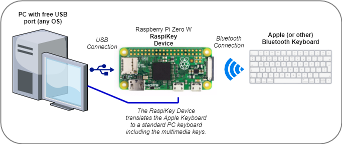
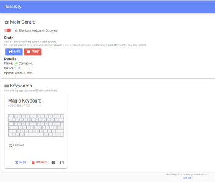
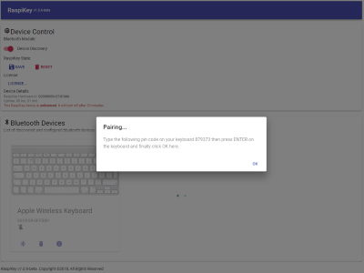

###### Universal Bluetooth to USB HID Adapter

RaspiKey converts any bluetooth keyboard to a universal wired USB (HID) keyboard. RaspiKey is software that runs on the [Raspberry Pi Zero W](https://www.raspberrypi.org/products/raspberry-pi-zero-w/) board.

It is particularly useful for the Apple Wireless keyboards because it can translate their exotic keymap to that of a standard USB PC keyboard. This an easy way to get them to seamlessly and fully work on a Windows PC (or any other device that is not an Apple computer), without the need to install software on it.

Features
--------

*   RaspiKey can host **any bluetooth keyboard** but it currently offers full keyboard compatibility (e.g. special multimedia keys support) only for the Apple Wireless (A1314) and the Apple Magic (A1644) keyboard models.
*   **Zero PC software footprint**. It does not require any driver installation or specific software installation on your PC that uses a connected keyboard.
*   **Self-consistent**. It does not require external power. It is self-powered through the PC USB port.
*   It is **inherently secure**. As it is a hardware device, there is no software driver running on your PC that can be hacked or compromised compared to a software driver solution.
*   RaspiKey **can be used on anything**; on any device that accepts a standard USB keyboard, not just on Windows PCs. This means that you can connect your Apple keyboard to your smart TV or your game console with full keyboard functionality.
*   It is robust and responsive. It is based on a cut-down, readonly OS runtime version of the official Raspbian Linux. There is no shutdown process, you just unplug the device when you want. The custom software is implemented 100% in C & C++ and runs in the real-time kernel scheduler policy. 

Screenshots
-----------

Hardware and Software Requirements
----------------------------------

*   A [Raspberry Pi Zero W](https://www.raspberrypi.org/products/raspberry-pi-zero-w/) device. The cheapest Zero W model (which is the one you need) currently sells for $10.
*   A cheap 2GB micro-SD card to burn the RaspiKey software on.
*   Access to a modern Windows PC with the Chrome browser to tether a keyboard to the Raspberry Pi board for the first time. You can then use the Raspberry Pi board and your keyboard on anything that has a USB keyboard port.

Installation and Use
--------------------

1.  Download [Apple Bonjour](https://developer.apple.com/bonjour/) and install it to Windows. The latest 32-bit and 64-bit versions are available [here](https://github.com/samartzidis/RaspiKey/tree/master/utilities).
2.  Download the latest RaspiKey **raspikey.xz** file from [here](https://github.com/samartzidis/RaspiKey/releases).
3.  Download [Etcher](https://etcher.io/).
4.  Use Etcher on Windows to burn raspikey.xz to a 2GB (if bigger doesn’t matter) micro-SD card.
5.  Insert the micro-SD card to the “Raspberry Pi Zero W” and then connect it to the computer using just the middle micro-USB port (labelled “USB” with tiny white letters). The Raspberry Pi will both draw power from this port as well as use it to communicate with the PC.
6.  Wait about 10 seconds. Then open Chrome on Windows at the address: **[http://raspikey.local](http://raspikey.local)**. You should then be able to use the RaspiKey configuration page.

BETA License
-------
RaspiKey is currently in BETA. Unless licensed, it will run for 30 minutes and then turn off automatically. If you would like a permanent license for testing please [e-mail me](https://github.com/samartzidis) and I'll be happy to send you one.

Known Issues
------------

*   The battery level indicator does not yet work for the Apple Magic (A1644) keyboard.
*   The Ctrl-LShift-T combination does not work on Apple keyboards, use the Ctrl-RShift-T instead where applicable.

Apple Keyboards Keymap
----------------------

<table>
    <tr>
      <th>Input Key(s)</th>
      <th>Output Key</th>
    </tr>
    <tr>
      <td><kbd>LCtrl</kbd></td><td><kbd>Fn</kbd></td>
    </tr>
    <tr>
      <td><kbd>Fn</kbd></td><td><kbd>LCtrl</kbd></td>
    </tr>
    <tr>
      <td><kbd>⏏︎ Eject</kbd></td><td><kbd>Del</kbd></td>
    </tr>
    <tr>
      <td><kbd>⌘ Cmd</kbd></td><td><kbd>Alt</kbd></td>
    </tr>    
    <tr>
      <td><kbd>⌥ Alt</kbd></td><td><kbd>Cmd</kbd></td>
    </tr>    
    <tr>
      <td><kbd>Fn</kbd>+<kbd>[F1]</kbd>...<kbd>[F6]</kbd></td><td><kbd>[F13]</kbd>...<kbd>[F18]</kbd></td>
    </tr>
    <tr>
      <td><kbd>Fn</kbd>+<kbd>LCtrl</kbd></td><td><kbd>RCtrl</kbd></td>
    </tr>
    <tr>
      <td><kbd>Fn</kbd>+<kbd>Return</kbd></td><td><kbd>Insert</kbd></td>
    </tr>
    <tr>
      <td><kbd>Fn</kbd>+<kbd>P</kbd></td><td><kbd>Prt Scr</kbd></td>
    </tr>
    <tr>
      <td><kbd>Fn</kbd>+<kbd>S</kbd></td><td><kbd>Scr Lck</kbd></td>
    </tr>
    <tr>
      <td><kbd>Fn</kbd>+<kbd>B</kbd></td><td><kbd>Pause/Break</kbd></td>
    </tr>
    <tr>
      <td><kbd>Fn</kbd>+<kbd>&uarr;</kbd></td><td><kbd>Pg Up</kbd></td>
    </tr>
    <tr>
      <td><kbd>Fn</kbd>+<kbd>&darr;</kbd></td><td><kbd>Pg Down</kbd></td>
    </tr>
    <tr>
      <td><kbd>Fn</kbd>+<kbd>&larr;</kbd></td><td><kbd>Home</kbd></td>
    </tr>
    <tr>
      <td><kbd>Fn</kbd>+<kbd>&rarr;</kbd></td><td><kbd>End</kbd></td>
    </tr>
  </table>

Planned Futures
---------------

*   Support for the latest full-size Apple Magic keyboard.
*   Support for user customizable keymap and programmability.
*   Support for multimedia or special key functions for more Bluetooth keyboards.
*   Support for multiple Bluetooth keyboards connected in parallel.

